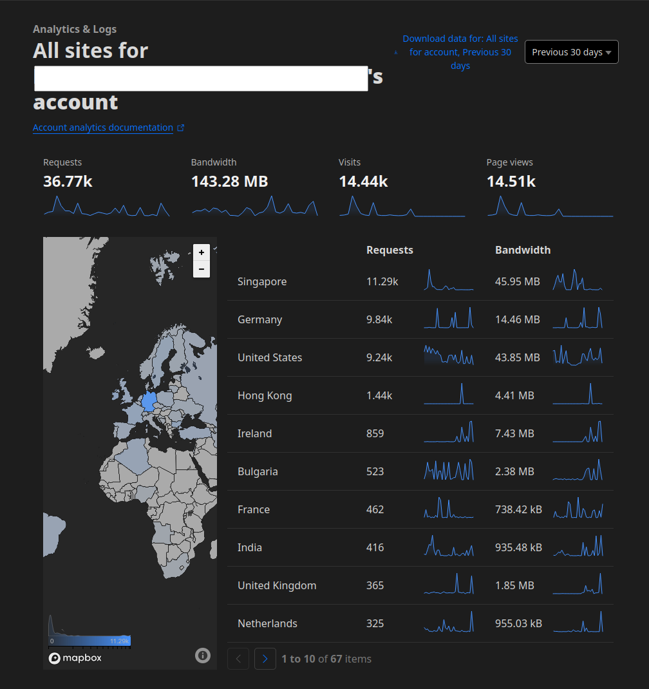
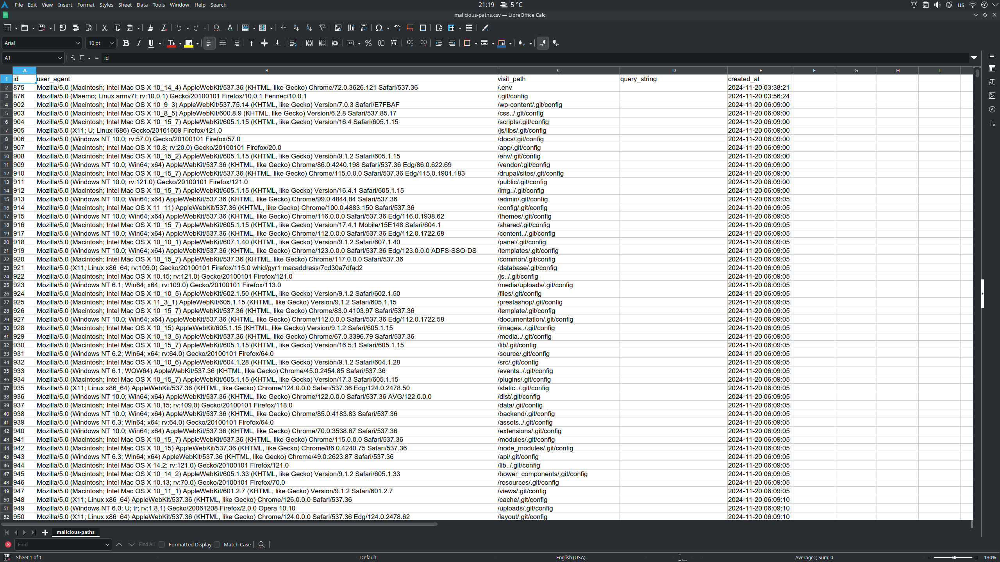

# Malicious Paths List

## What Is This?
This repository contains a dataset of 4,500+ malicious web paths commonly used by attackers and bots. These paths were logged from **November 20, 2024** to **January 5, 2025**, with over 80,000 requests recorded during this period and more than 35,000 requests in the last 30 days. These requests were captured on new domains with no prior activity, ensuring that all requests were unsolicited and unwanted.

By analyzing these logs, I identified a wide range of paths targeting vulnerabilities or attempting to exploit web servers, making this dataset a valuable resource for improving security and reducing server load.

## When Not to Use This List
If your website has only a small set of known and valid paths (e.g., an API or a static website), it may be more efficient and secure to block **all traffic by default** and explicitly allow only the valid paths. This approach eliminates unnecessary complexity and ensures only legitimate traffic is served.

For example:
- **Static sites**: Instead of allowing all traffic, block everything by default and explicitly allow only known pages like `/about`, `/contact`, or other specific valid paths.
- **APIs**: Restrict access to only the endpoints you need.

This list is better suited for websites with more dynamic or complex structures where blocking specific malicious paths is more practical.

## Why and How to Block These Paths
### Benefits of Blocking:
1. **Enhance Security**:
   - Many of the paths in this dataset target specific vulnerabilities (e.g., `.env`, `.git/`, or outdated CMS admin panels).
   - Blocking these paths reduces the risk of exploitation.

2. **Improve Efficiency**:
   - By dropping bad traffic early, you save server resources like bandwidth and processing power.

3. **Optimize Network Traffic**:
   - Blocking requests at a higher level (e.g., a CDN like Cloudflare or your server firewall) minimizes traffic reaching your web server, reducing network and server load.

### Implementation:
- **Block at the CDN Level**: Use services like Cloudflare to filter malicious paths before they reach your server.
- **Server-Level Blocking**:
  - Blocking such a large number of paths at the server level in Apache or NGINX might not be practical due to performance considerations. Instead, it is recommended to use a Web Application Firewall (WAF) or a custom script to handle this at a higher level, optimizing network and server efficiency.

## Why No IPs?
To respect privacy, I chose not to include the IPs of the visitors in this dataset, even though over 80% were flagged as proxies or spam by IP2Location. It is unclear whether these IPs were flagged before or after visiting my domains.

### Recommendation:
While blocking these paths can significantly improve security, I recommend combining this dataset with tools like **IP2Location** or similar proxy detection services for even better results. This way, you can block unwanted traffic at multiple levels.

## Screenshot of the Dataset
Here is a screenshot of the dataset to give you an idea of how the data looks:

